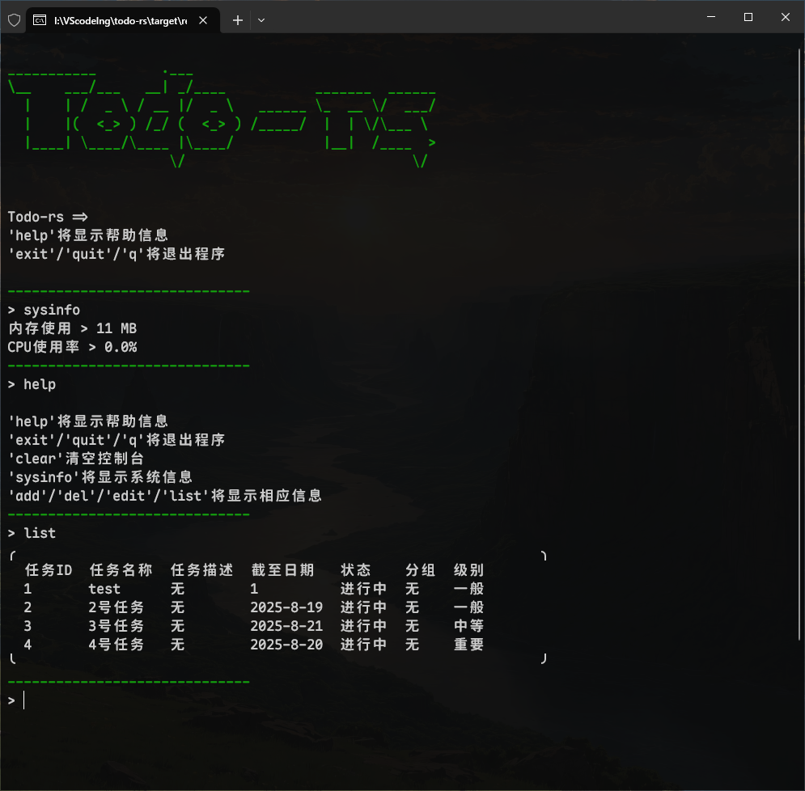

### Todo-rs
一个基于rust的命令行todo列表工具

开发日志：https://mrtowc.xlog.app/1Todo-rs

#### 借鉴资料
jemalloc 内存分配器 
https://juejin.cn/post/7350320544526516263   
https://www.cnblogs.com/RioTian/p/18970973   
comfy-table 表格输出   
https://crates.io/crates/comfy-table   
将终端搬入浏览器   
https://zellij.dev/news/web-client-multiple-pane-actions/   

#### 简易展示

#### 快捷指令
'help'将显示帮助信息   
'exit'/'quit'/'q'将退出程序   
'clear'清空控制台   
'sysinfo'将显示系统信息   
'add'/'del'/'edit'/'list'将显示相应信息   
'/done id'、'/undone id'将任务状态改为完成或改错了，再改为未完成   
'/group done'   
'/save'备份数据   
'/calendar' 显示日历？   

#### 计划项目功能
- 任务完成类型： 
每天|每周|每月|每年|X次|指定日期前完成
- 任务级别：普通/重要/紧急
- 多窗口与托盘化运行： 
可以在多个窗口中查看和管理任务，例如查看指定组的任务详情，就会在新窗口中显示
- 任务emoji美化输出： 
任务名前显示emoji符号，显示任务状态。 
红/黄/绿 字体颜色： 任务级别(一般/重要/紧急) 
字体画删除线：任务完成状态 
单任务/整个组内任务完成就画一条删除线。 
最后显示截至日期与剩余天数
- 编辑时，若输入内容为空，则编辑不修改原内容 
- 按关键词查找任务 
- 表格化输出 
- 批量操作:  
    输入一次指令，编辑多个任务，比如批量完成任务。
- 完成记录 
    每个任务完成后，会记录下完成时间
- 日志记录 
    每次操作都会记录下操作时间、操作类型、操作内容 
    同时记录下当时所占内存、cpu占用率 

#### 项目优化
删除任务时不对任务ID进行重新排序 
或者id可以为 1-1/0，1代表第1个任务，1/0表示任务是否有效