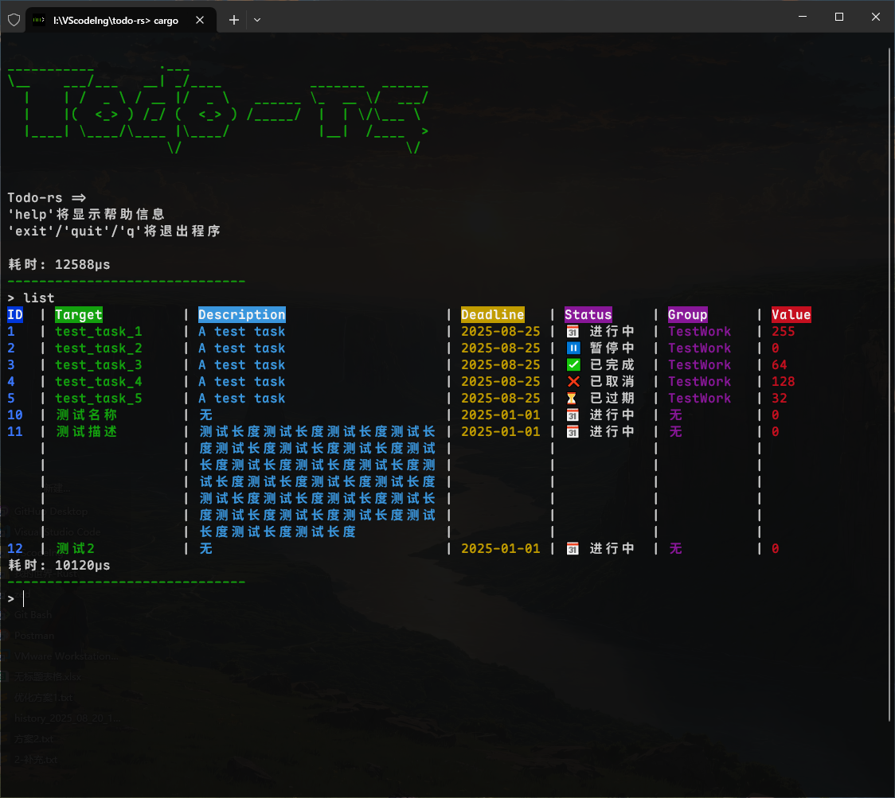

### Todo-rs
一个基于rust的命令行todo列表工具

开发日志：https://mrtowc.xlog.app/1Todo-rs

#### 借鉴资料
jemalloc 内存分配器\
https://juejin.cn/post/7350320544526516263  \
https://www.cnblogs.com/RioTian/p/18970973  \
comfy-table 表格输出  \
https://crates.io/crates/comfy-table  \
将终端搬入浏览器  \
https://zellij.dev/news/web-client-multiple-pane-actions/  \
Tracing简要使用\
https://rust-book.junmajinlong.com/ch102/tracing.html

#### 简易展示

#### 快捷指令
✅ 'help'将显示帮助信息\
✅ 'exit'/'quit'/'q'将退出程序\
✅ 'clear'清空控制台\
✅ 'sysinfo'将显示系统信息\
✅ 'add'/'del'/'edit'/'list'将显示相应信息\
'list sort 字段名 倒叙 / 正序'\
'list group' 只显示某个组\
'/group done'\
'/save'备份数据\
'/calendar' 显示日历？

#### 计划项目功能
- 任务完成类型：\
每天|每周|每月|每年|X次|指定日期前完成
- ✅ 任务级别：普通/重要/紧急
- 多窗口与托盘化运行：\
可以在多个窗口中查看和管理任务，例如查看指定组的任务详情，就会在新窗口中显示
- ✅ 任务emoji美化输出：\
任务名前显示emoji符号，显示任务状态。\
红/黄/绿 字体颜色： 任务级别(一般/重要/紧急)\
字体画删除线：任务完成状态\
单任务/整个组内任务完成就画一条删除线。\
最后显示截至日期与剩余天数
- ✅ 编辑时，若输入内容为空，则编辑不修改原内容
- ✅ 按关键词查找任务
- ✅ 表格化输出
- ✅ 批量操作: \
    输入一次指令，编辑多个任务，比如批量done|del任务。
    任务id用空格隔开，例：\
    'status [Pause|Active|Done|Cancel|OutTime] [id]'\
    'del [id]'
- 完成记录\
    每个任务完成后，会记录下完成时间
- 日志记录\
    每次操作都会被动的记录下操作时间、操作类型、操作内容\
    同时记录下当时所占内存、cpu占用率\
    格式：\
    [info]时间戳:用户指令:内存占用:cpu占用率:执行时间

#### 项目优化
删除任务时不对任务ID进行重新排序\
或者id可以为 1-1/0，1代表第1个任务，1/0表示任务是否有效
